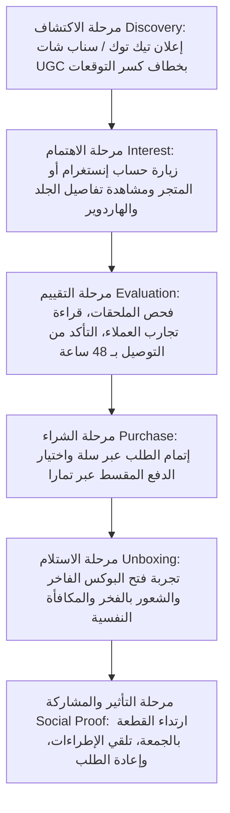

# 03. Lifecycle & Journey Maps | رحلة العميل ومراحل التحول

## تفاصيل مراحل الرحلة:
1. **مرحلة الاكتشاف (Top of Funnel):** لفت الانتباه بخطاف قوي يكسر التوقعات ("لا تدفعين 20 ألف في شنطة ديور.. تعالي شوفي البديل الذكي!").
2. **مرحلة التقييم (Middle of Funnel):** إزالة كافة الاعتراضات عبر إبراز ماكرو الجلود، فحص الأختام، وتوضيح الشحن السريع المحلي.
3. **مرحلة التحويل (Bottom of Funnel):** تبديد التردد المالي عبر إبراز شعار تمارا وضمان الاسترجاع والتسليم بـ 48 ساعة.
4. **مرحلة الولاء (Post-Purchase Retention):** متابعة ما بعد البيع برسائل واتساب راقية، وعروض خاصة للعميلات الدائمات على الكولكشنات الجديدة.
