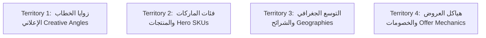

# 01. The Four Territories | الأراضي الأربع للاختبار والتوسع

* **الإقليم 1 (Creative Angles):** اختبار زاوية كسر التوقعات vs زاوية إنقاذ المناسبات vs زاوية المقارنة بالعين المجردة.
* **الإقليم 2 (Hero SKUs):** اختبار الطلب على أحذية السهرات (جيمي تشو) مقابل حقائب الكروس اليومية (بوتيغا/سيلين).
* **الإقليم 3 (Geographies):** اختبار قوة التحويل في مدن المنطقة الشرقية (الخبر/الدمام) مقابل جدة والرياض.
* **الإقليم 4 (Offer Mechanics):** اختبار عرض الشحن المجاني مع تمارا مقابل عرض خصم القطعة الثانية 30%.
