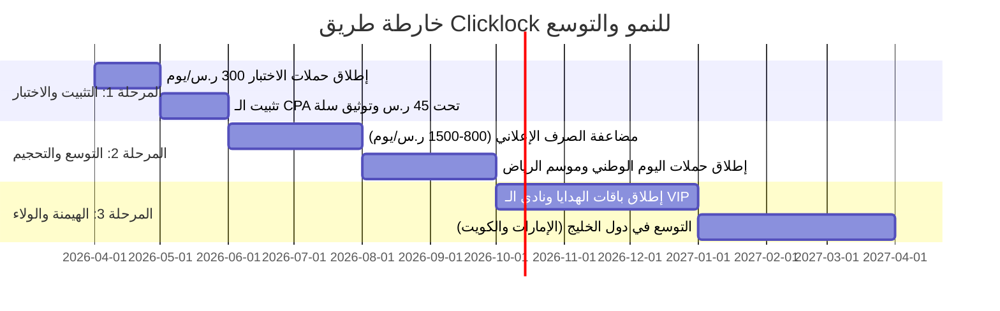

# 01. Strategic Roadmap & SWOT Analysis | خارطة الطريق الاستراتيجية وتحليل سوات

---

## 1. تحليل سوات الشامل (SWOT Analysis)

```
                                ┌──────────────────────────────────┐
                                │     Clicklock SWOT Matrix        │
                                └────────────────┬─────────────────┘
             ┌─────────────────────┬─────────────┴─────────────┬─────────────────────┐
             ▼                     ▼                           ▼                     ▼
     [ Strengths (نقاط القوة) ]  [ Weaknesses (نقاط الضعف) ]   [ Opportunities (الفرص) ]  [ Threats (التهديدات) ]
     • مخزون وتوصيل محلي 48h    • تكلفة تجميد رأس المال بالرياض • نمو التجارة الإلكترونية 23% • سياسات حقوق الملكية بالإعلانات
     • جودة 1:1 وجلود طبيعية    • استبدال مقاسات الأحذية والكعوب• فجوة الثقة لدى المنافسين • حرب أسعار التقليد الرديء
     • تقسيط تمارا 4 دفعات + COD • حداثة البراند وبناء السمعة   • مواسم الرياض والأعياد     • تقلبات سلاسل التوريد للمخزون
     • تجربة البوكس والأنبوكسينج • الاعتماد على الإعلانات الممولة • التوسع في الإكسسوارات   • منافسة حسابات الواتساب الفردية
```

### تفاصيل مصفوفة سوات (SWOT Matrix):
* **نقاط القوة (Strengths):**
  1. شحن وتوصيل فوري خلال 24–48 ساعة من مستودعات الرياض يقضي على ألم الانتظار الطويل.
  2. جودة ماستر كواليتي 1:1 بجلود طبيعية وهاردوير معالج ثقيل يقضي على فوبيا الافتضاح.
  3. أمان الدفع عبر تمارا (4 دفعات) وخيار الدفع عند الاستلام والمعاينة.
  4. تجربة أنبوكسينج ملكية متكاملة بالبوكس المقوى الأصلي والدست باق وكروت السيريال.
* **نقاط الضعف (Weaknesses):**
  1. تكلفة الاحتفاظ بمخزون محلي متعدد الموديلات في الرياض.
  2. احتمالية طلبات استبدال المقاسات في فئة الأحذية والكعوب مقارنة بالحقائب.
  3. الحاجة المستمرة لإنتاج محتوى UGC لبناء الثقة الاجتماعية الأولية للبراند.
* **الفرص (Opportunities):**
  1. نمو التجارة الإلكترونية بالسعودية 23% وتصدر الرياض في القوة الشرائية للأزياء (بيانات وزارة التجارة).
  2. فجوة الثقة والشكاوى الكبرى لدى المنافسين بسبب بطء الشحن ورداءة الخامات.
  3. استغلال مواسم الرياض، الأعياد، ويوم التأسيس واليوم الوطني.
  4. التوسع في إكسسوارات الفخامة الصامتة (Quiet Luxury): نظارات، محافظ، سكارفات حرير.
* **التهديدات (Threats):**
  1. قيود المنصات الإعلانية (Meta/TikTok) على أسماء العلامات التجارية المحمية.
  2. حرب الأسعار من مقلدي الدروب شيبينغ الصيني الرديء بأسعار بخسة تضر سمعة الفئة.
  3. تقلبات سلاسل التوريد والشحن الدولي للمستودع المحلي قبل المواسم الكبرى.

---

## 2. مراحل التوسع والنمو السنوي لـ Clicklock (12 شهراً)


