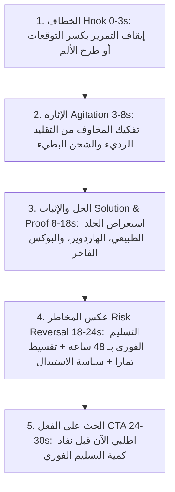

# 03. Script Processes | معادلة كتابة السكربت الإعلاني الخماسي

```mermaid
graph TD
    H[1. الخطاف Hook 0-3s: إيقاف التمرير بكسر التوقعات أو طرح الألم] --> A[2. الإثارة Agitation 3-8s: تفكيك المخاوف من التقليد الرديء والشحن البطيء]
    A --> S[3. الحل والإثبات Solution & Proof 8-18s: استعراض الجلد الطبيعي، الهاردوير، والبوكس الفاخر]
    S --> R[4. عكس المخاطر Risk Reversal 18-24s: التسليم الفوري بـ 48 ساعة + تقسيط تمارا + سياسة الاستبدال]
    R --> C[5. الحث على الفعل CTA 24-30s: اطلبي الآن قبل نفاد كمية التسليم الفوري]
```
