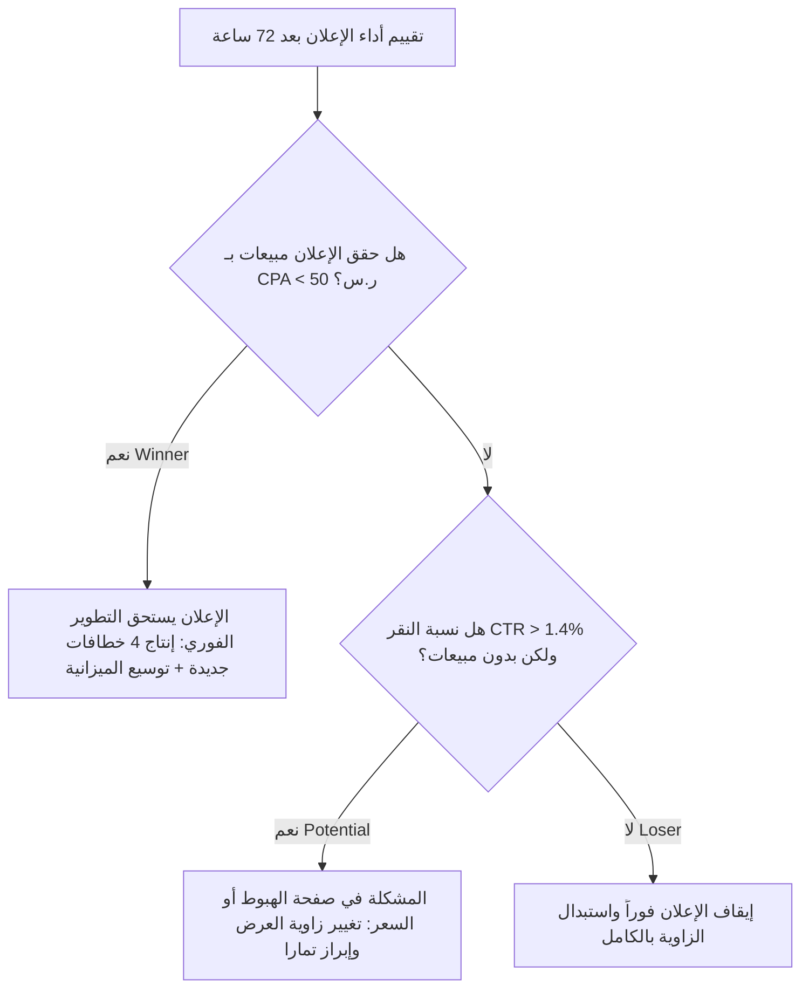

# 01. Which Ads Deserve It | شجرة قرارات تدوير وتطوير الإعلانات

```mermaid
graph TD
    A[تقييم أداء الإعلان بعد 72 ساعة] --> B{هل حقق الإعلان مبيعات بـ CPA < 50 ر.س؟}
    B -- نعم Winner --> C[الإعلان يستحق التطوير الفوري: إنتاج 4 خطافات جديدة + توسيع الميزانية]
    B -- لا --> D{هل نسبة النقر CTR > 1.4% ولكن بدون مبيعات؟}
    D -- نعم Potential --> E[المشكلة في صفحة الهبوط أو السعر: تغيير زاوية العرض وإبراز تمارا]
    D -- لا Loser --> F[إيقاف الإعلان فوراً واستبدال الزاوية بالكامل]
```
